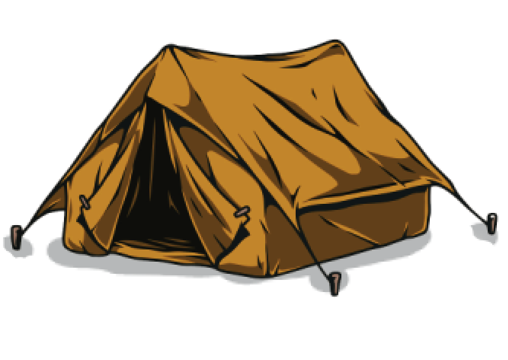

# CampfireHunt

<p align="center">
  
</p>

A 2D top-down action game built in C using [Raylib](https://www.raylib.com/), where players defend a campfire against waves of monsters across 3 stages.

## Features

- **Single player & local multiplayer** (2 players on one keyboard)
- **4 playable characters** — Red, Blue, Yellow, and Purple Warriors
- **3 stages** with increasing enemy difficulty
- **Two enemy types** — Goblins (melee attackers) and Monmons (faster roaming enemies)
- Collect coins, heal with meat pickups, and survive the 6-minute time limit
- High score saved between sessions for both single and multiplayer modes

## Screenshots


## Controls

### Single Player
| Action | Keys |
|--------|------|
| Move   | `WASD` or Arrow Keys |
| Attack | `Left Mouse Button` (while moving) |
| Pause  | `Escape` |

### Multiplayer (2 players, shared keyboard)
| Action     | Player 1        | Player 2       |
|------------|-----------------|----------------|
| Move       | `WASD`          | Arrow Keys     |
| Attack     | `Left Shift`    | `Right Shift`  |
| Pause      | `Escape`        |                |

## Building from Source

Requirements: GCC and the included Raylib library files (in `lib/` and `include/`).

```bash
gcc CampfireHunt.c -o CampfireHunt -Iinclude -Llib -lraylib -lopengl32 -lgdi32 -lwinmm
```

Then run the compiled executable. Make sure `raylib.dll` is in the same directory as the binary.

## Project Structure

```
CampfireHunt/
├── CampfireHunt.c      # Main source file
├── include/            # Raylib headers
├── lib/                # Raylib static/import libraries
├── images/             # Game sprites and textures
├── audio/              # Sound effects and music
├── single.txt          # Single player high score save
└── multi.txt           # Multiplayer high score save
```

## Built With

- **C** (C99)
- **[Raylib](https://www.raylib.com/)** — graphics, audio, and input
- **Raygui** — UI elements (menus, buttons)

## License

This project was developed as a university assignment for COS10009 at Swinburne University of Technology.
